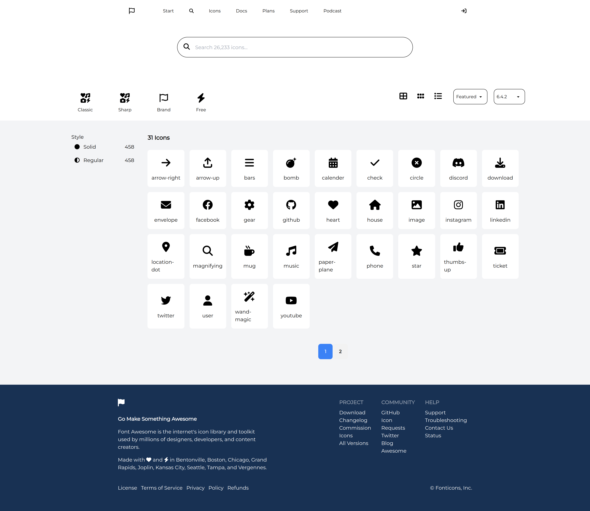

# Iconosome - Your Icon Search App

Iconosome is a web application built with React that allows users to search and filter icons using FontAwesome icons data. It replicates the FontAwesome search page and offers a user-friendly interface for finding the perfect icons for your project.



## Table of Contents

-   [Features](#features)
-   [Tech Stack](#tech-stack)
-   [Getting Started](#getting-started)
-   [Project Structure](#project-structure)
-   [Challenges and Limitations](#challenges-and-limitations)


## Features

-   **Icon Search:** Quickly find icons by name, category, or style.
-   **Filtering Icons:** Filter icons by category and style.
-   **Multiple Selection:** Select multiple filters simultaneously.
-   **Sorting Option:** Sort icons by name or category.
-   **Responsive Design:** Works seamlessly on various screen sizes.

## Tech Stack

-   React: A JavaScript library for building user interfaces.
-   FontAwesome: Provides a wide range of icons for use in web projects.
-   Tailwind CSS: A utility-first CSS framework for building custom designs quickly.
-   daisyUI: A plugin for Tailwind CSS.

## Getting Started

To get a local copy of the project up and running, follow these steps:

1. Clone this repository:

    ```bash
    git clone https://github.com/zhSHUVO/iconosome.git
    ```

2. Navigate to the project folder:

    ```bash
    cd iconosome
    ```

3. Install the dependencies:

    ```bash
    npm install
    ```

4. Start the development server:

    ```bash
    npm run dev
    ```

5. Open your browser and visit [http://localhost:5173/](http://localhost:5173/) to access Iconosome.

## Project Structure

-   `src/`: Contains the main source code for the React application.
    -   `components/`: Includes React components used in the app.
    -   `assets/`: Store SVG icons or other static assets here.
    -   `App.js`: The main application component.
    -   `data/`: Icon data in a json file.

## Challenges and Limitations

While working on this assignment, I encountered several challenges and limitations that I'd like to acknowledge:

1. **Font Compatibility:** Integrating the exact FontAwesome font used on the FontAwesome website proved challenging due to licensing and technical constraints. As a result, I used a suitable alternative font to maintain a consistent design.

2. **Icon Colors:** FontAwesome icons on their website have specific colors, which are more difficult to replicate when using SVG files directly. I used predefined classes for color styling but couldn't achieve the exact color fidelity as seen on the original site.

3. **Measurement Discrepancies:** Adapting measurements and positioning to replicate the FontAwesome layout precisely was challenging. Differences in font metrics and SVG rendering may lead to slight variations in icon alignment and spacing.

4. **Responsive Design:** While I aimed for a responsive design, certain screen sizes and devices may not render the layout optimally. Further improvements can be made to enhance responsiveness.

These challenges highlight the complexities involved in replicating a complex web page like FontAwesome's search page and offer opportunities for future improvements and learning.
